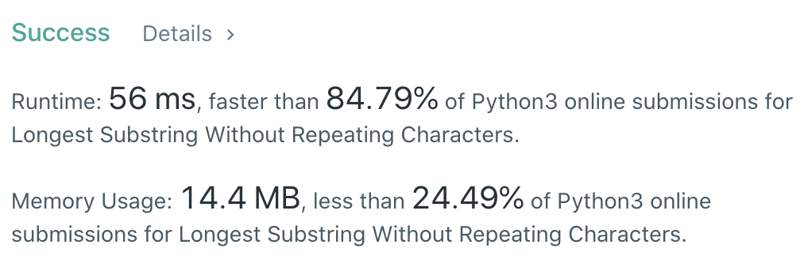

CXPhoenix's Solution
===

## 3. Longest Substring Without Repeating Characters

Given a string s, find the length of the longest substring without repeating characters.

---

## My Thought

- 看到說要找到最長不重複字母的子字串，第一個想法就是去比對這個字元是否在他之前的子字串中出現過。
- 做法是建立一個指針 `start` ，並且指向 0 的位置，接著利用 `loop` 依序讀入字串 `s`。
- 當從字串 `s` 中讀入的字元有在子字串 `s[start:Now_Character_Index]` 之間的話，那麼就將 start 移到重複字元之 `index + 1` 。
- 以上判斷步驟直到把字串 `s` 跑完。

- 在 [solution1](./solution1.py) 中，我加入一個 `try...except...` 判斷是因為 `str.index(substring, [start, [end]])` 的方法中，如果不在其中則會噴出 error ，所以得特別處理。

```python
class Solution:
    def lengthOfLongestSubstring(self, s: str) -> int:
        start = 0
        maxLen = 0
        for i in range(len(s)):
            try:
                start = s.index(s[i], start,i)+1
            except:
                if maxLen < i - start + 1:
                    maxLen = i - start + 1
                
        return maxLen
```



- 但是本題應該是要練習如何處理找尋 index 的部分，因此寫了第二個版本。
- 我利用 `dict` 來記錄遍歷過的字元及其 index。
- 在判斷中我去檢查是否有紀錄以及該紀錄是否大於 `start` 指針，來判斷是否在現在要檢查的子字串中。
- 請見 [solution2](./solution2.py)

```python
class Solution:
    def lengthOfLongestSubstring(self, s: str) -> int:
        length = 0
        maxLen = 0
        start = 0
        sub = {}
        for i in range(len(s)):
            if (sub.get(s[i]) or sub.get(s[i]) == 0) and sub.get(s[i]) >= start :
                maxLen = length if maxLen < length else maxLen
                start = sub.get(s[i]) + 1
                length = i-start+1
            else:
                length += 1
            sub[s[i]] = i
        maxLen = len(s) - start if maxLen < len(s) - start else maxLen
        return maxLen
```


> 時間上應該都是 Lucky hunt 啦 lol

---

## Big-O

solution1 && solution2  ->  `O(n)`