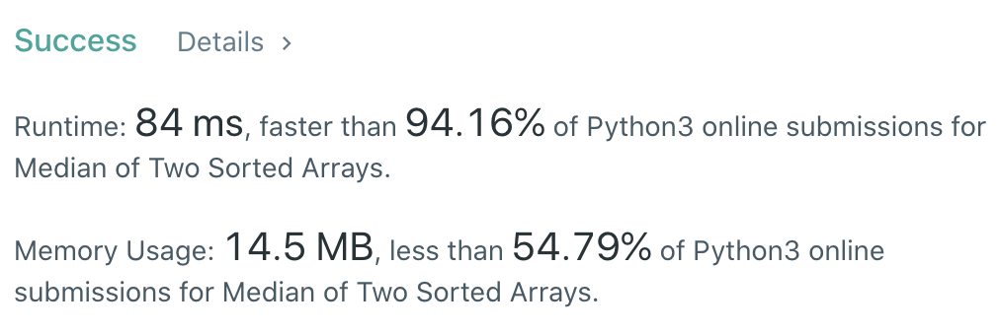

CXPhoenix's Solution
===

## 4. Median of Two Sorted Arrays

Given two sorted arrays nums1 and nums2 of size m and n respectively, return the median of the two sorted arrays.

The overall run time complexity should be O(log (m+n)).

---

## My Thoughts

- 雖然題目寫說時間複雜度應該為 O(log(m+n))，但是我想不到什麼辦法，就把陣列中的所有 case 都 run 一遍吧！
- 利用 `loop` 將兩個陣列合併並排序，最後找到中間值輸出。
- [solution1](./solution1.py) 就這樣處理了！

```python
class Solution:
    def findMedianSortedArrays(self, nums1: List[int], nums2: List[int]) -> float:
        nums = []
        while len(nums1) and len(nums2):
            if nums1[0] < nums2[0]:
                nums.append(nums1.pop(0))
            else:
                nums.append(nums2.pop(0))
        
        if not len(nums1):
            nums.extend(nums2)
        if not len(nums2):
            nums.extend(nums1)
        
        if len(nums) % 2:
            return float(nums[len(nums)//2])
        return (nums[len(nums)//2] + nums[len(nums)//2 - 1]) / 2
```


- 想一想，來用用看 Python 的語法看看速度如何
- 因此產生 [solution2](./solution2.py)

```python
class Solution:
    def findMedianSortedArrays(self, nums1: List[int], nums2: List[int]) -> float:
        nums = sorted([*nums1, *nums2])
        if len(nums) % 2:
            return float(nums[len(nums)//2])
        return (nums[len(nums)//2]+nums[len(nums)//2-1])/2
```



- 執行時間參考就好，基本上是 lucky hunt

---

## Big-O

solution1 -> O(m+n)
solution2 -> O((m+n)*log(m+n)) (`sorted()` in python uses the quick-sort algorithm)