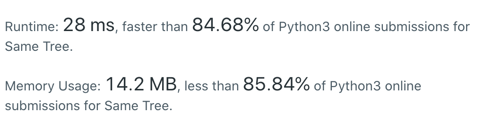

CXPhoenix's solutions
===

## 100. Same Tree

Given the roots of two binary trees p and q, write a function to check if they are the same or not.

Two binary trees are considered the same if they are structurally identical, and the nodes have the same value.

---

## My Thoughts

- 看到題目，首先想到的是前中後序的樹走訪，而根據題目的說法，應該是屬於前序走訪，因此開始利用這個特性處理。
- 原本是希望利用像是 linked list 的方式進行走訪，但是在回訪階段會出現問題，因此開始思考其他可能性。
- 後來真的想不出來，上網查詢了樹的走訪，關鍵字為：「Python 樹走訪」。
- 經過資料查詢，發現我想得太複雜了，事實上在走訪上利用遞迴的 stack 特性可以達到全部走訪的效果。
- 而這個遞迴的 Base case 是當兩個樹的 node 皆為 `None` 時代表他們的所有值都是相同的回傳 `True`; 如果只有其中一個變成 `None`，代表另一棵樹還沒走完，那就不是同樣結構的樹，所以回傳 `False`; 如果走訪到的值是不一樣的，那麼也是回傳 `False`，最後就是持續走訪，但是利用 and 同時繼續走訪左樹跟右樹。

[solution](./solution.py)

```python
class Solution:
    def isSameTree(self, p: TreeNode, q: TreeNode) -> bool:
        if not p and not q:
            return True
        if not p or not q:
            return False
        if p.val != q.val:
            return False
        return self.isSameTree(p.left, q.left) and self.isSameTree(p.right, q.right)
```



---

## Big-O

solution -> O(n)