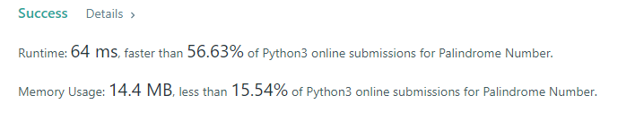
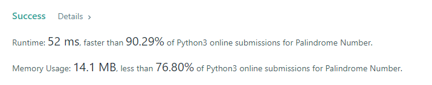

CXPhoenix's Solution
===

## 9. Palindrome Number
Given an integer x, return true if x is palindrome integer.

An integer is a palindrome when it reads the same backward as forward. For example, 121 is palindrome while 123 is not.

---
## My Thought
- 首先想到的是利用迴圈依序比對字串中對應的位置進行分析 [見 solution1.py](./solution1.py)
```python
# solution1.py
class Solution:
    def isPalindrome(self, x: int) -> bool:
        x = str(x)
        for i in range(len(x)//2):
            if x[i] != x[len(x)-i-1]:
                break
        else:
            return True
        return False
```
- 在中間我使用了 Python 針對 for 迴圈的小技巧：當迴圈是「正常情況，沒有 break」而停下來，則可以用一個 `else` 去承接後續想做的動作，因此這邊設定 `當沒有比對完成，沒有被 break 掉的話，就一定是回文`。
- solution1 結果\


- 但是 solution1 時間較慢，後來想想，回文的特性是正的反的都一樣，那是不是把字串反過來，跟原字串比對看看是不是一樣就好了呢？因此產生 [solution2.py](./solution2.py)
```python
# solution2.py
class Solution:
    def isPalindrome(self, x: int) -> bool:
        return True if str(x) == str(x)[::-1] else False
```
- leetcode 上面的顯示速度快了至少 10ms 左右。但是這有可能是因為 for 迴圈表達式帶來的邊際效應。
- solution2 結果\

---
## Big-O
solution1 ->  O(n)

solution2 ->  O(n)