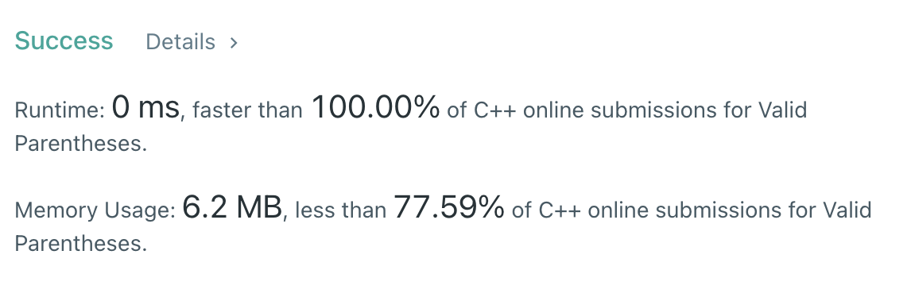
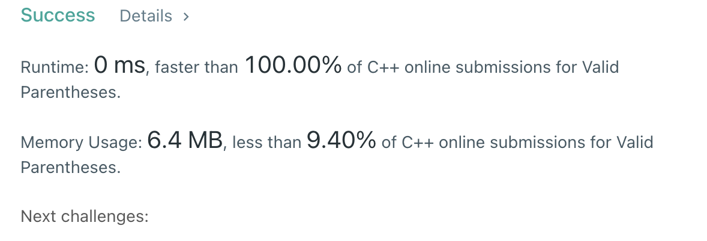

# 20. Valid Parentheses

Easy

## Description

Given a string s containing just the characters '(', ')', '{', '}', '[' and ']', determine if the input string is valid.

An input string is valid if:

- Open brackets must be closed by the same type of brackets.
- Open brackets must be closed in the correct order.

## My Thought

A **parentness** means `(){}[]` and any pair of them can inside a parentness
So, i found **stack** may useful in this problem.

1. create two function for check char is in left close or right close, and what type it is.
2. Check length of string, if < 2. it is not valid.
3. Check it is left close or not, if true than push into stack
4. Else it musr a pair with top of stack. Or invalid
5. Finally stack must be empty, means all left close is paired.

I habe two solution, first use an **array and loop** to check what kind of close it is,
Second way use map to store close and map index of close directly.

If we have a lot of symbol to check, second way will faster than first way. But worst space.

### [Solution 1]('./Solution1.cpp')

### [Solution 2]('./Solution1.cpp')

# O(n) time both, O(1) space first way, O(k) space second way.