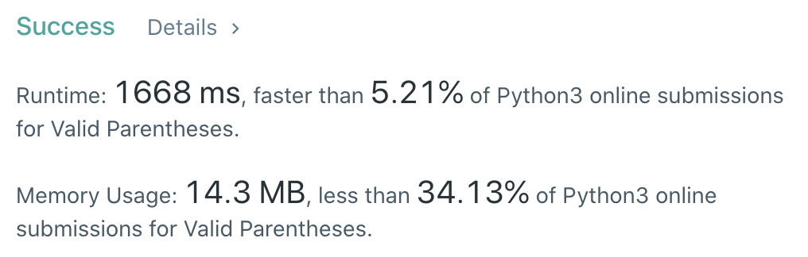
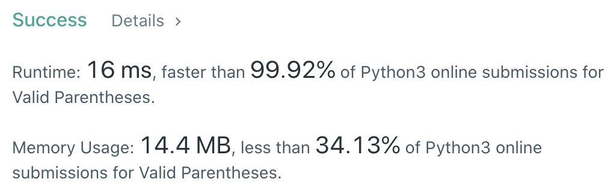

CXPhoenix's Solutions
===

## 20. Valid Parentheses

Given a string s containing just the characters '(', ')', '{', '}', '[' and ']', determine if the input string is valid.

An input string is valid if:

- Open brackets must be closed by the same type of brackets.
- Open brackets must be closed in the correct order.

---

## My Thoghts
今天直接看 Code 吧～

- [solution1](./solution1.py)
```python
class Solution:
    def isValid(self, s: str) -> bool:
        sign = {
            '(':')',
            '{':'}',
            '[':']'
        }
        startSign = ['(', '{', '[']
        endSign = [')', '}', ']']
        
        start = 0
        if s[start] in endSign:
            return False
        for i in range(1, len(s)):
            if s[i] == sign.get(s[start]) and not ((i-start+1)%2) and self.countPair(s[start:i+1]):
                start = i+1
            if start == i:
                continue
            if start > len(s) -1:
                return True
        return False
    
    def countPair(self, s:str) -> bool:
        count = {
            '(':0,
            '{':0,
            '[':0,
            ')':0,
            '}':0,
            ']':0
        }
        for i in s:
            count[i] += 1
            if i == ')' and count.get(i) > count.get('(') or i == '}' and count.get(i) > count.get('{') or i == ']' and count.get(i) > count.get('['):
                return False
        if count.get('(') != count.get(')') or count.get('{') != count.get('}') or count.get('[') != count.get(']'):
            return False
        return True
```



- [solutino2](./solution2.py)

```python
class Solution:
    def isValid(self, s: str) -> bool:
        sign = {
            '(':')',
            '{':'}',
            '[':']',
            ')':'(',
            '}':'{',
            ']':'['
        }
        startSign = ['(', '{', '[']
        endSign = [')', '}', ']']
        record = []
        for i in range(len(s)):
            if i == 0 and s[i] in endSign:
                return False
            try:
                if s[i] in endSign and sign[s[i]] != record.pop():
                    return False
            except:
                return False
            if s[i] in startSign:
                record.append(s[i])
        return record == []
```



---

## Big-O

- solution1 -> O(n^2)
- solution2 -> O(n)