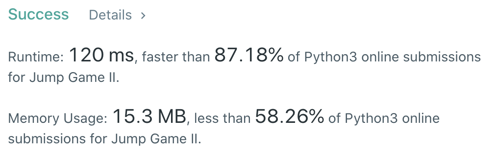

CXPhoenix's solution
===

## 45. Jump Game II

Given an array of non-negative integers `nums`, you are initially positioned at the first index of the array.

Each element in the array represents your maximum jump length at that position.

Your goal is to reach the last index in the minimum number of jumps.

You can assume that you can always reach the last index.

---

# My Thought

- 這一題看完題目開始，我想到的就是直接暴力拆解。
- 讓我的數字開始往後執行，並且計算我是否能一步到尾。
- 如果不行，我就計算我的下一步能不能一步到尾。
- 如果還是不行，就找到我可以移動到的最遠位置。
- 持續不斷到移動結束後回傳移動次數。
- 由於我每次都盡可能在過程中移動最遠，所以加起來的移動次數一定是最少的。

[solution](./solution.py)

```python
class Solution:
    def jump(self, nums):
        # 指定目前位置以及移動次數 cursor, count = 0
        cursor = 0
        count = 0
        # 如果 length 小於 2 ，代表不用移動，移動量為 0 (early return)
        if len(nums) < 2:
            return 0
        # 執行 cursor 直到最後一位
        while cursor < len(nums)-1:
            # 如果提前算出我自己這個位置就可以移動到 list 的尾巴的話，就直接結束，並且回傳 count + 1
            if cursor + nums[cursor] >= len(nums) - 1:
                return count + 1
            # 如果沒有我就設定最大距離以及最佳位置（貪婪法）
            largestProfit = 1
            maxRoad = nums[cursor]
            for i in range(1, nums[cursor]+1):
                # 如果我提前算出走到下一個點一定可以走到結尾，那麼就直接回傳，並且 count + 2
                if cursor+i + nums[cursor+i] >= len(nums) - 1:
                    return count + 2
                # 如果沒有可以走完，那就記錄在可以移動距離內，最佳的移動位置（可以走最遠）
                if cursor+i + nums[cursor+i] > maxRoad:
                    largestProfit = i
                    maxRoad = cursor+i+nums[cursor+i]
            # 讓 cursor 移動到最佳位置，並且讓 count += 1
            cursor = cursor + largestProfit
            count += 1
        return count
```



---

## Big-O

solution -> O(n)