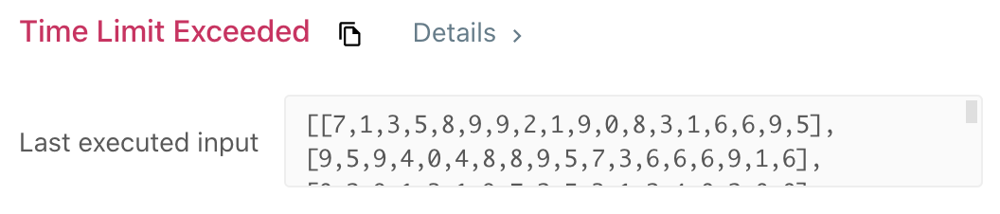
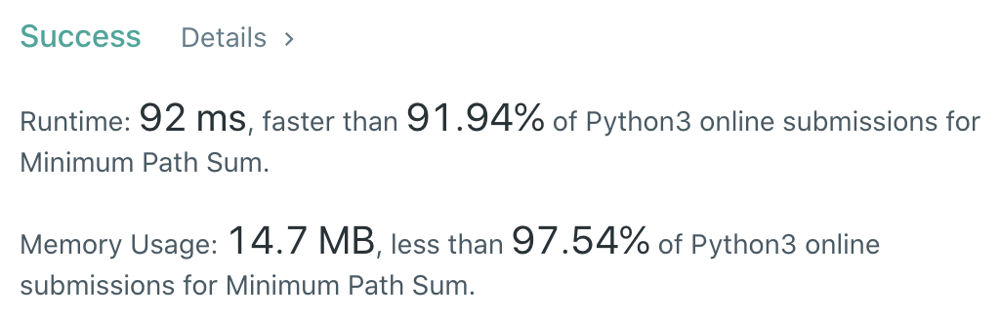

CXPhoenix's Solutions
===

## 64. Minimum Path Sum

Given a `m` `x` `n` `grid` filled with non-negative numbers, find a path from top left to bottom right, which minimizes the sum of all numbers along its path.

*Note:* You can only move either down or right at any point in time.

---

## My Thoughts

- 看到這題時，我想到了昨天的題目，我覺得可以用 DP 去解決這個問題，但是我實在想不到要怎麼建立起表格，因此我想先用另一種方法試試看。
- 我想到之前「樹的走訪」方法，我就將原始陣列變成一顆二元樹（因為只能往右或往下走），左子樹為向下，右子樹為向右，這樣就可以生成所有路徑，然後去比對找到最短路徑。
- 因此產生了下面的 [solution](./solution-TimeLimitedError.py)

```python
class Solution:
    def minPathSum(self, grid: List[List[int]]) -> int:
        row = 0
        col = 0
        record = 0
        def goThrough(grid, row, col, record, maxRow=len(grid)-1, maxCol=len(grid[0])-1):
            if row == maxRow and col == maxCol:
                return record+grid[row][col]
            if row > maxRow or col > maxCol:
                return float("inf")
            return min(goThrough(grid, row+1, col, record+grid[row][col]), goThrough(grid, row, col+1, record+grid[row][col]))
        return goThrough(grid, row, col, record)
```

- 聰明如我，這樣應該就萬無一失了吧！？沒想到....



- 好喔...我還是得回頭看 DP ...

> 經過了一陣子後...

- 我思索了半天，圖行畫了半天，矩陣都畫滿兩面 A3 了...
- 突然想到，如果這張表格紀錄的是我走到每一格的結果，並且比對我從哪個方向走會是最短的，接著放入表格中作為下一格（向右向下）的走訪結果參考，那麼不就能找到最短路徑了嗎！？
- 所以我就實作了以下 [solution](./solution.py)

```python
class Solution:
    def minPathSum(self, grid: List[List[int]]) -> int:
        DP = [[0]*len(grid[0])]*len(grid)
        for r in range(len(grid)):
            for c in range(len(grid[0])):
                if r - 1 >= 0 and c - 1 >= 0:
                    DP[r][c] = min(DP[r-1][c]+grid[r][c], DP[r][c-1]+grid[r][c])
                elif r - 1 >= 0:
                    DP[r][c] = DP[r-1][c] + grid[r][c]
                elif c - 1 >= 0:
                    DP[r][c] = DP[r][c-1] + grid[r][c]
                else:
                    DP[r][c] = grid[r][c]
        return DP[len(grid)-1][len(grid[0])-1]
```



- 成功解出！
- 回頭回顧前面的想法，才發現，原來當在一定限制下，利用表格紀錄就不用往前追朔，只要找到當前該格的紀錄就可以了！
- 啊啊，終於會 DP 的皮毛了...

---

## Big-O

solution -> O(n)

