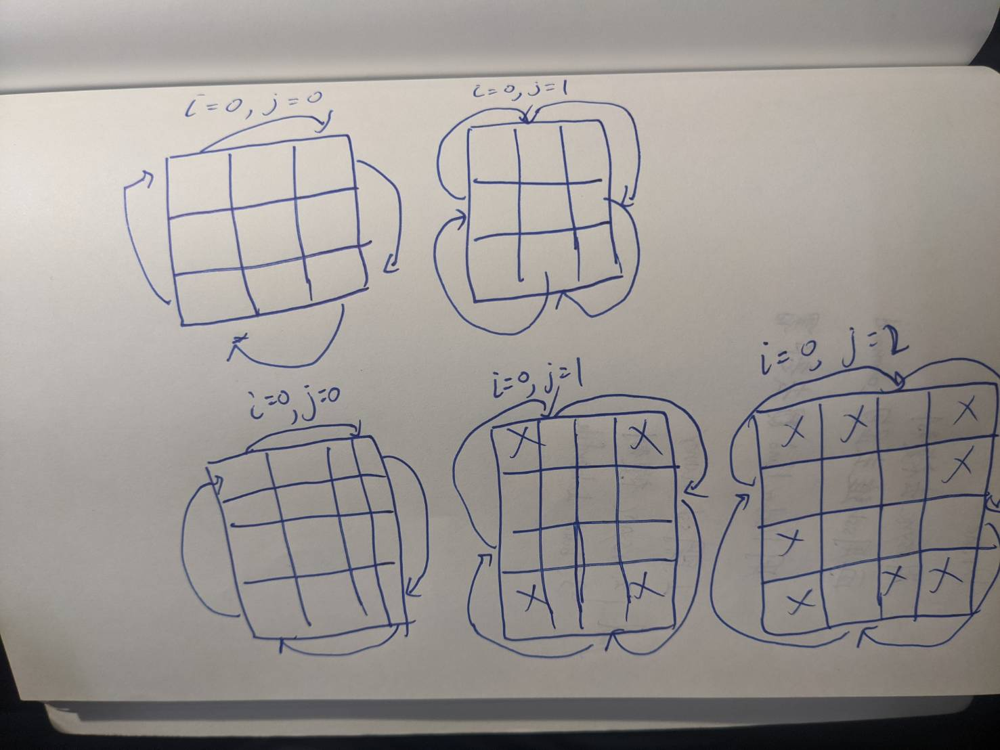

# 21. Merge Two Sorted Lists

Easy

## Description

Merge two sorted linked lists and return it as a *sorted* list. The list should be made by splicing together the nodes of the first two lists.

## My Thoghts

As the image, we replace each element to the 90 degree clockwise element.

```c++
class Solution
{
public:
  void rotate(vector<vector<int>> &matrix)
  {
    // get width of matrix
    int n = matrix.size();
    for (int i = 0; i < n / 2; i++)
    {
      for (int j = i; j < n - i - 1; j++) // bound is -1 becuse corner will replace in first loop
      {
        int temp = matrix[i][j];
        matrix[i][j] = matrix[n - j - 1][i];
        matrix[n - 1 - j][i] = matrix[n - 1 - i][n - 1 - j];
        matrix[n - 1 - i][n - 1 - j] = matrix[j][n - 1 - i];
        matrix[j][n - 1 - i] = temp;
      }
    }
  }
};
```
## O(n^2)