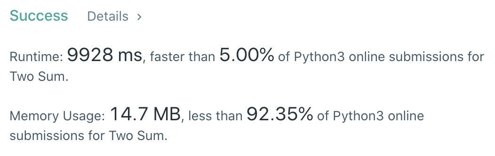
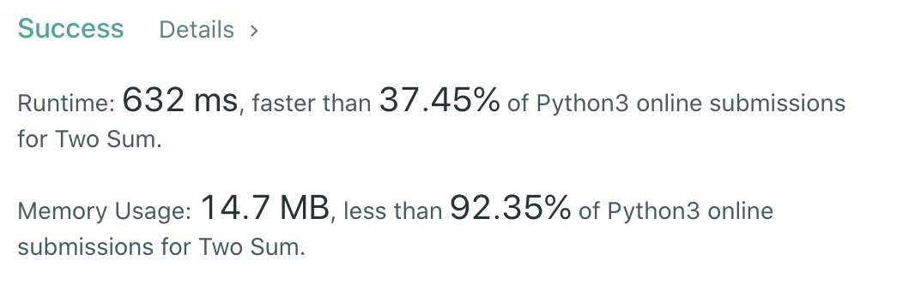
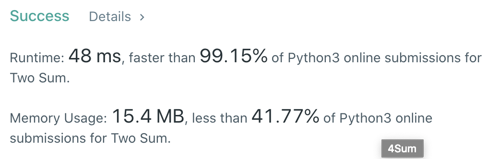

CXPhoenix's Solution
===

## 1. Two Sum

Given an array of integers nums and an integer target, return indices of the two numbers such that they add up to target.
You may assume that each input would have exactly one solution, and you may not use the same element twice.
You can return the answer in any order.

---

## My Thoughts

- 找到兩個相加符合 target 的數，而且可以直接假定有唯一解，那麼我第一個想到的就是暴力來啦！
- 簡單來說就是去遍歷所有的數字，利用巢狀迴圈來找到所有可能並挑出正確的解。
- 也就是找到了 [solution1](./solution1.py)

```python

```



- 但是這樣實在太慢了....時間複雜度很差，所以看到題目後面有寫

```

```

- 很明顯了，就是叫你找其他方式...想了很久，就決定先給自己一點成就感，利用 Python 的內建函式庫來玩玩看。
- 所以就看到 [solution2](./solution2.py)

```python

```



- 通體舒暢後，我開始思考 Big-O 不要這麼大的方法，因此翻了翻書。
- 結論是翻書沒用...因為沒想法，翻書也不會出現...
- 所以我還是靠自己苦思想了想，如果要更快的話，就要讓我查詢的時候，產生小於 O(n) 的時間複雜度，可是這題也不能用二元搜尋，
因為資料沒有排序...
- 那麼就只剩 O(1) 這個搜尋方式，對應的就是利用 `hash table`。
- 我把資料記起來存在 key，然後 value 存放他的位置，當我找到一個值時，我就去尋找有沒有這個值已經存過了，有的話，太棒了，直接 `return` ，沒有的話，我就把當前值存進 `hash table` 中並且往下一個值前進。
- 所以有了 [solution3](./solution3.py)

```python

```



- 恩，快超多...畢竟複雜度降低非常多，但是我不想用 `if...in...` 了，因為這樣的複雜度還是 O(n)，沒有達到 O(1) 的效果，我決定用 `try...except...` 來玩玩看。
- 有了 [solution4](./solution4.py)

```python

```


- 舒服～

---

## Big-O

solution1 && solution2 -> O(n^2)
solution3 && solution4 -> O(n)