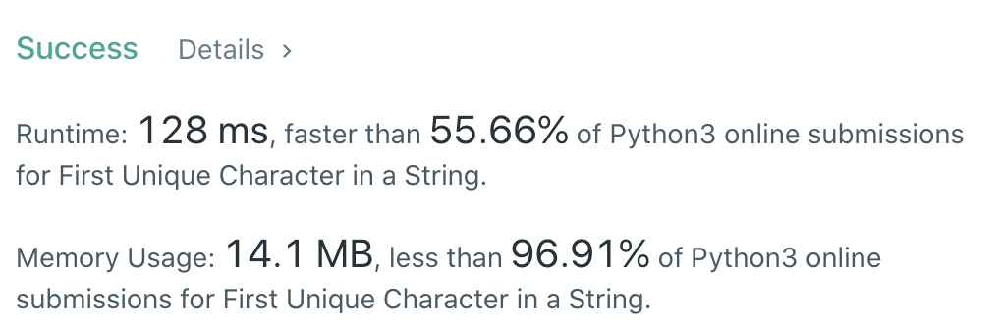

CXPhoenix's Solution
===

## 387. First Unique Character in a String

Given a string `s`, find the first non-repeating character in it and return its index. If it does not exist, return `-1`.

---

## My Thoughts

- 這題說可以用 queue 解題，但是我實在想不到..所以我就用了一個土方法解決。
- 我建立一個字典 `record` 來記錄 `value: index` 關係。
- 但是當我發現有重複值時，就將該 key-pair value 改為 `1e5` ，因為題目限制的 `len(s)` 為 `1e5`。
- 然後最後就是從 `record.values()` 的找到最小的值，如果找到的最小值大於 `len(s)` ，那麼就等於沒有單獨存在的字，就 `return -1`。
- 所以就有了 [solution1](./solution1.py)

```python
class Solution:
    def firstUniqChar(self, s: str) -> int:
        record={}
        for i in range(len(s)):
            if record.get(s[i]) is not None:
                record[s[i]] = 1e6
            else:
                record[s[i]] = i
        return min(record.values()) if min(record.values()) < len(s) else -1
```




---

## Big-O

O(n)