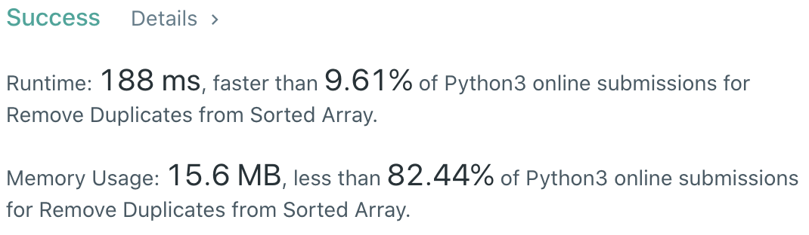

CXPhoenix's Solution
===

## 26. Remove Duplicates from Sorted Array

the question's link here 👇👇👇

[Remove Duplicates from Sorted Array](https://leetcode.com/problems/remove-duplicates-from-sorted-array)

---

## My Thoughts

這一題非常神奇，我得說雖然簡單，但是我想破頭也不知道該怎麼減少時間ＱＷＱ

- 用原陣列去操作修改
- 把重複的從原陣列去掉
- 回傳沒有重複的數量

我想到的方法：

1. 利用 Python 的 in 特性去找到前面重複的值

- 所以產生了 [solution1](./solution1.py)

2. 我思索，用 `in` 語法搜尋是 O(n)，那我是不是可以減少搜尋的時間？所以我改用 `binary search`

- 因此產生了 [solution2](./solution2.py)

但是為什麼這兩者時間，後者明明 Big-O 比較少，卻比較慢呢？

我猜可能是因為 Binary search 用了 recursive 的關係。但是具體我還得再查查

---

## Big-O

solution1 -> O(n^2)

solution2 -> O(n*log(n))
