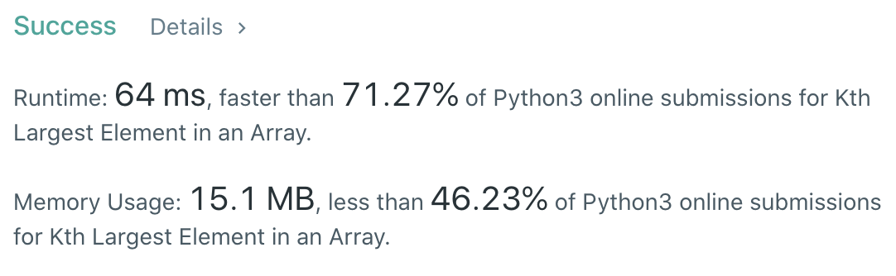

CXPhoenix's Solution
===

## 215. Kth Largest Element in an Array

[original question](https://leetcode.com/problems/kth-largest-element-in-an-array)

---

## My Thoughts

就..排序後找到第 k 大的

但是聽說要用heap sort

我用內建的 quick sort

結案

[solution](./solution.py)

---

## Big-O

O(nlogn)