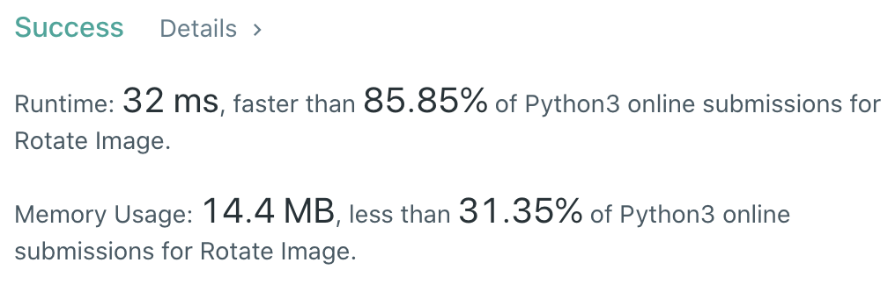

CXPhoenix's Solution
===

## 48. Rotate Image

You are given an `n x n` 2D `matrix` representing an image, rotate the image by _90_ degrees (clockwise).

You have to rotate the image `in-place`, which means you have to modify the input 2D matrix directly. _DO NOT_ allocate another 2D matrix and do the rotation.

---

## My Thoughts

- 翻轉陣列算是滿簡單的題目，但是這次 *要在陣列中* 直接操作，就沒這麼簡單了。
- 原本想說，那就把它放到其他陣列在合回來就好啦！但是結果不會過，因為陣列的賦值是 pass by reference。
- 因為是 pass by reference ，所以後來被賦予的 `matrix` 就跟原本的 `matrix` 就不同記憶體位置了，因此不能這樣操作。
- 我想到的方法是，翻轉後的先放在原本的 `matrix` 後面，然後再刪除前面的，這樣就完成了。
- 來看 [solution code](./solution.py) 吧！

```python
class Solution:
    def rotate(self, matrix: List[List[int]]) -> None:
        """
        Do not return anything, modify matrix in-place instead.
        """
        n = len(matrix)
        for col in range(n):
            tmp = []
            for row in range(n):
                tmp.append(matrix[n-1-row][col])
            matrix.append(tmp)
        del(matrix[:n])
```



---

## Big-O

O(n^2)