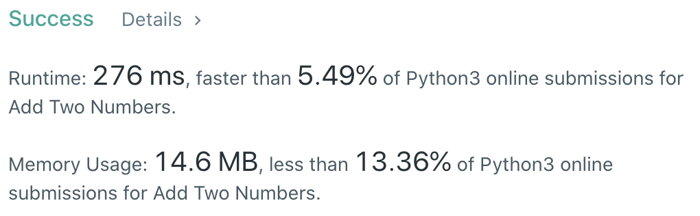
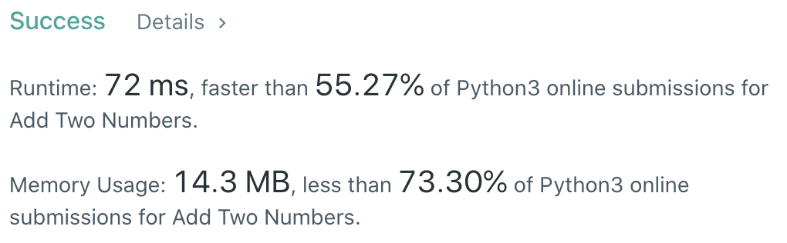

CXPhoenix's solution
===

## 2. Add Two Numbers

You are given two _non-empty_ linked lists representing two non-negative integers. The digits are stored in _reverse order_, and each of their nodes contains a single digit. Add the two numbers and return the sum as a linked list.

You may assume the two numbers do not contain any leading zero, except the number 0 itself.

---

## My Thoughts

- 首先，這是一題加法題，所以就是按照加法的邏輯處理。
- 我先用 dirty 的方式來寫，然後就像 [solution1](./solution1.py) 一樣

```python
# Definition for singly-linked list.
# class ListNode:
#     def __init__(self, val=0, next=None):
#         self.val = val
#         self.next = next
class Solution:
    def addTwoNumbers(self, l1: ListNode, l2: ListNode) -> ListNode:
        sumList = ListNode()
        cursor = sumList
        over9 = 0
        while l1 or l2:
            print(f'{cursor}\n{l1}\n{l2}')
            if not l1:
                cursor.val += l2.val+over9
                if cursor.val > 9:
                    cursor.val %= 10
                    over9 = 1
                else:
                    over9 = 0
                l2 = l2.next
                if l2:
                    cursor.next = ListNode()
                else:
                    cursor.next = ListNode(over9) if over9 else None
                cursor = cursor.next
                continue
            if not l2:
                cursor.val += l1.val+over9
                if cursor.val > 9:
                    cursor.val %= 10
                    over9 = 1
                else:
                    over9 = 0
                l1 = l1.next
                if l1:
                    cursor.next = ListNode()
                else:
                    cursor.next = ListNode(over9) if over9 else None
                cursor = cursor.next
                continue
            
            cursor.val += l1.val + l2.val + over9
            if cursor.val > 9:
                cursor.val %= 10
                over9 = 1
            else:
                over9 = 0
            l1 = l1.next
            l2 = l2.next
            if l1 or l2:
                cursor.next = ListNode()
            else:
                cursor.next = ListNode(over9) if over9 else None
            cursor = cursor.next
            
        return sumList
```



- 但是真的太多重複的東西了，所以整理完變成 [solution2](./solution2.py)

```python
# Definition for singly-linked list.
# class ListNode:
#     def __init__(self, val=0, next=None):
#         self.val = val
#         self.next = next
class Solution:
    def addTwoNumbers(self, l1: ListNode, l2: ListNode) -> ListNode:
        sumList = ListNode()
        c = sumList
        over9 = 0
        while l1 or l2:
            if not l1:
                c.val += l2.val + over9
                l2 = l2.next
            elif not l2:
                c.val += l1.val + over9
                l1 = l1.next
            else:
                c.val += l1.val + l2.val + over9
                l1 = l1.next
                l2 = l2.next
            
            if c.val > 9:
                over9 = 1
                c.val %= 10
            else:
                over9 = 0
            
            c.next = ListNode() if l1 or l2 else ListNode(1) if over9 else None
            c = c.next
        return sumList
```



- 不過好像有一個變數可以不用，所以有了 [solution3](./solution3.py)

```python
# Definition for singly-linked list.
# class ListNode:
#     def __init__(self, val=0, next=None):
#         self.val = val
#         self.next = next
class Solution:
    def addTwoNumbers(self, l1: ListNode, l2: ListNode) -> ListNode:
        sumList = ListNode()
        c = sumList
        while l1 or l2:
            if not l1:
                c.val += l2.val
                l2 = l2.next
            elif not l2:
                c.val += l1.val
                l1 = l1.next
            else:
                c.val += l1.val + l2.val
                l1 = l1.next
                l2 = l2.next
            
            if c.val > 9:
                c.next = ListNode(1)
                c.val %= 10
            else:
                c.next = ListNode() if l1 or l2 else None
            c = c.next
        return sumList
```


---

## Big-O

O(n) ->  n = Length 較大的 Linked-List