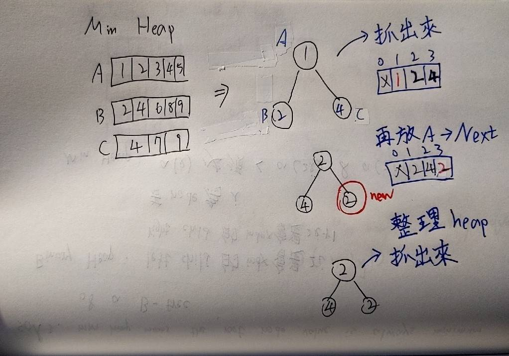

# 23. Merge k Sorted Lists
Hard

## Description

You are given an array of <code>k</code> linked-lists <code>lists</code>, each linked-list is sorted in ascending order.

## My Thoghts

### Solutoion1: Merge all into 1 list and sort
`O(longNK)`
---
### Solution2: Divide and Conquer

Merge 2 lists one time, first time is `K/2` lists

Second time is `K/4` lists

`O(nklogk)`
---
### Solution3: Min Heap

A `min heap` means top of a tree always minimum.

So we create a tree have K elements

And pop top of heap then push new one into head from the list which head just pop.

`O(nklogn)`

