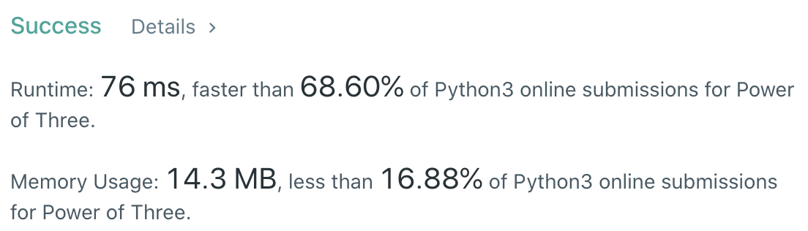
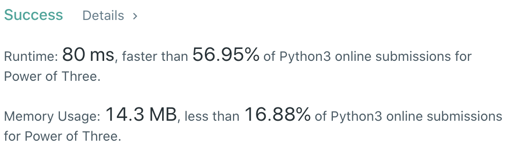

CXPhoenix's Solution
===

## 326. Power of Three

[original question](https://leetcode.com/problems/power-of-three)

---

## My Thoughts

今天的題目就是因式分解的一種玩法

- 不解釋，直接上 code

[solution1](./solution1.py)

但是題目說到不能要用迴圈或遞迴解，讓我想不出來

直到看到 Hello 的 code...我恍然大悟

對啦！如果我用一個極大的 3 次方數去當被除數，除數為 input 的數字

那麼，如果有餘數， input 進來的數字就不是 3 次方數，

反之，沒餘數，就是 3 次方數

原來如此啊...

上 code!

[solution2](./solution2.py)

---

## Big-O

solution1 -> O(log(3)(n))
solution2 -> O(1)