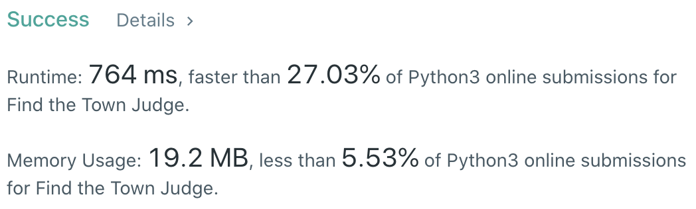

CXPhoenix's Solutions
===

## 1039. Find the Town Judge

[original question](https://leetcode.com/problems/find-the-town-judge)

---

## My Thoughts

本題的概念很簡單，就是找到

1. 不在 `ai` 中
2. 所有 `ai` 都有對應到同一個  `bi` （除了自己）

所以我想到，將所有的 `bi` 都提出來放進一個 hash table `record` 中，作為 key ，而 value 先初始化為一個空陣列，

而接下來的遍歷所有 `ai` 並且當 `ai in record.keys()` ，就表示條件錯誤，將其從 record 中刪除，

最終只會留下一筆（含）以下的資料，再來驗證這筆資料的 key-value pairs 中的 list 是否包含除了自己以外的元素。

有則回傳該 key 值，沒有就回傳 `-1`

這邊的一個例外就是 `n == 1 and len(trust) == 0` 的情況，這邊需要回傳 `1` 而非 `-1`

就看到 [solution](./solution.py)

--- 

## Big-O

O(2n)