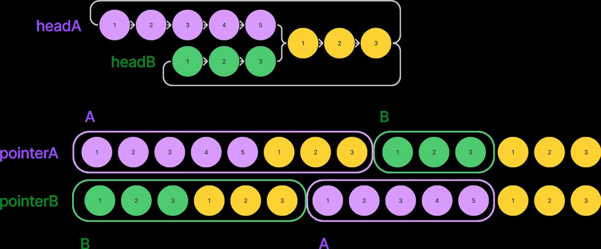

# Intersection of Two Linked Lists

## Submissions

Runtime: 110 ms, faster than 27.38% of JavaScript online submissions for Intersection of Two Linked Lists.
Memory Usage: 47 MB, less than 11.95% of JavaScript online submissions for Intersection of Two Linked Lists.

## Solution

1. 跑迴圈把 headA 加入 Set
2. headB 跑迴圈，一一比對 Set 中是否有相同的 node，找到則回傳該 node，否則回傳 null

## Follow up solution

找到另一個解法，兩個 pointer 沿著 list 走，到尾巴時接到另一個 list，最後兩者會在交錯點遇到，若沒有遇到最後會回傳 null。

```javascript
var getIntersectionNode = function (headA, headB) {
    let currA = headA,
        currB = headB;
    while (currA !== currB) {
        if (!currA) {
            currA = headB;
        } else {
            currA = currA.next;
        }
        if (!currB) {
            currB = headA;
        } else {
            currB = currB.next;
        }
    }
    return currA;
};
```


